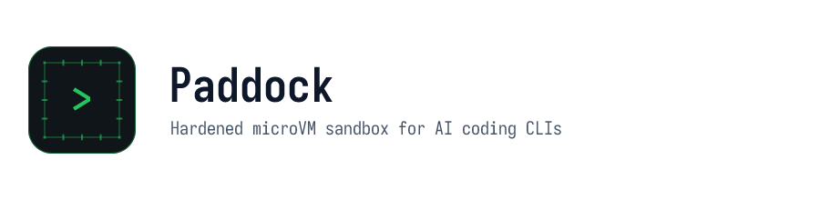

<p align="center">
  <picture>
    <source media="(prefers-color-scheme: dark)" srcset="docs/logo-header-dark.png">
    <source media="(prefers-color-scheme: light)" srcset="docs/logo-header-light.png">
    
  </picture>
</p>

**Paddock** is a secure, lightweight, project-specific sandboxed runtime container environment designed to run AI coding assistants (such as OpenCode, Gemini CLI, and Claude Code) in complete, virtualized isolation from your host system.

Unlike complex multi-bind sandboxes, Paddock utilizes a **Pure Containerfile Layering** strategy and a **Pristine Home Directory** strategy to provide 100% transparent and standard host bind-mounting under a highly hardened, VM-level virtualization boundary.

---

## Prerequisites & Requirements

### Host Environment for Sandboxing (`run`)
*   **Linux Host** with KVM support (microVM sandboxing is Linux-only).
*   Rootless **Podman** container engine.
*   The **`krun`** container runtime (or `libkrun`) and the **`pasta`** network isolator.

### Host Environment for Automatic Upgrades (`upgrade`)
*   **`curl`**: Used to query latest stable version metadata from the NPM registry.
*   **`jq`**: Used to parse JSON payloads.
*   **`openssl`**: Used for portable, cross-platform Base64-to-Hex conversions of registry integrity hashes.

---

## Key Features

1.  **Simple Command Interface:** A single, easily-remembered shell command `./paddock.sh` (or native `podman container runlabel`) to build and run sandboxes.
2.  **MicroVM Virtualization (`krun`):** Shakes off standard shared-kernel container namespace boundaries, executing the sandbox cleanly inside its own KVM-backed microVM using `libkrun` and the `krun` runtime.
3.  **Tightly Hardened Sandbox:** Out-of-the-box system-wide hardening:
    - Strips all Linux capabilities (`--cap-drop ALL`).
    - Disables all privilege escalation paths (`no-new-privileges`).
    - Mounts the system root filesystem as **read-only** (`--read-only`).
    - Secures `/tmp` inside an in-memory, size-limited, non-executable filesystem (`tmpfs` with `noexec,nosuid,nodev`).
    - Restricts runaway processes or fork-bombs (`--pids-limit`).
4.  **Pasta Network Isolation:** Combines isolated network namespaces via modern `pasta` with `passt` translation annotations (`krun.use_passt=1`) for high-performance and secure network sandboxing.
5.  **MicroVM Resource Capping:** Restricts the guest VM from consuming host resources using libkrun annotations:
    - Caps the guest's available RAM (`krun.ram_mib`).
    - Restricts the number of virtual CPU cores (`krun.cpus`).
6.  **Secure Workspace Mounting:** Automatically mounts the current host directory at `/home/ai/sandbox` inside the container.
7.  **Persistent CLI Configs:** Standard host bind-mounting to the unprivileged `/home/ai` folder preserves credentials, shell histories, and CLI caches across container runs without named volumes.
8.  **Clean System Defaults:** Environment prompts and standard tools are declared system-wide, keeping `/home/ai` completely empty in the image.

> The concrete limits (RAM, vCPU count, `/tmp` size, PID cap) are intentionally not
> reproduced here. For `default`, they are baked into the image at build time by
> `paddock.sh` itself (see `run_label_for()`), overridable via `PADDOCK_RAM_MIB`,
> `PADDOCK_CPUS`, `PADDOCK_PIDS_LIMIT` and `PADDOCK_TMP_SIZE`; `./paddock.sh rebuild`
> is required for a changed env var to actually take effect. Any other profile
> defines its own `LABEL run` directly in its `Containerfile`.

---

## Project Structure

```text
paddock/
├── profiles/
│   ├── base/
│   │   ├── entrypoint.sh       # Secure guest VM privilege-dropping entrypoint
│   │   └── Containerfile       # Defines 'paddock-base:latest'
│   └── default/
│       └── Containerfile       # Default general-purpose profile: starts FROM paddock-base:latest, builds 'paddock:latest'
├── paddock.sh                  # Simple execution/orchestration shell script
├── test_paddock.sh             # Automated mock-based test suite
└── README.md
```

---

## Getting Started

### 1. Build a Profile
To build a profile (or build the core `paddock-base`):
```bash
# Builds the general-purpose default profile
./paddock.sh build

# Or build a specific profile
./paddock.sh build default
```
`build` only does work when the image is missing or older than its `Containerfile` (or, for
`default`, `paddock.sh` itself), and refreshes `paddock-base` the same way. `run` performs the same
check before launching, so an edit takes effect on the next run. To rebuild unconditionally:
```bash
./paddock.sh rebuild          # forces the default profile and its base
```

#### Overriding a Profile
Any profile can be personally customized without touching a tracked file: a
`~/.local/share/paddock/profiles/<profile>/Containerfile`, if present, takes precedence over the
shipped `profiles/<profile>/Containerfile` for that profile name. For example, create
`~/.local/share/paddock/profiles/default/Containerfile` to customize the general-purpose sandbox on
your own machine — it still builds and runs as `paddock:latest` regardless of which Containerfile
backs it, and still gets the same `paddock.sh`-baked run label (see below) as the shipped
Containerfile. The same mechanism works for `base` or any other profile, and works whether
`paddock.sh` was checked out from git or installed system-wide.

#### Bundled AI Assistants
The base image installs both `opencode` (`opencode-ai`) and the Gemini CLI (`@google/gemini-cli`)
globally, alongside the Google Cloud CLI. No build-time selection is required.

> Because the Google Cloud CLI is published only for `x86_64`, `paddock-base` is an **x86_64-only**
> image.

### 2. Run a Profile
To run your project inside a sandbox:
```bash
# Run inside the general-purpose default profile sandbox
./paddock.sh run

# Or run inside a specific custom profile sandbox
./paddock.sh run default
```
This automatically:
*   Prepares a persistent local home folder on the host at `~/.local/share/paddock/homes/default`. A single shared home means all profiles reuse the same credentials, shell history, and caches out-of-the-box.
*   Delegates the launch to the profile's `LABEL run` via `podman container runlabel`, mounting the current directory at `/home/ai/sandbox`.
*   Starts an interactive bash shell as the non-root `ai` user in that workspace.

> `base` is an abstract parent image with no `LABEL run`; `./paddock.sh run base` is rejected.

---

## Native Podman `runlabel` Support
Every profile's image carries a `LABEL run`, which is the single definition of every mount and security flag — for `default`, baked in by `paddock.sh` at build time (see "Key Features" above); for any other profile, written directly in its `Containerfile`. `./paddock.sh run` simply invokes it, so running Podman directly is equivalent and needs no checkout of this repository:
```bash
podman container runlabel run paddock:latest
```
The label deliberately omits `--name`, so Podman assigns a unique container name on each launch and
you can run sandboxes from several directories concurrently. Use `podman ps` to find the generated
name.

---

## Architecture: Pristine Home Directory & Guest Privilege Dropping
To prevent container file masking (hiding pre-installed files inside the image), Paddock ensures `/home/ai` in the image is **completely empty**:
*   Custom terminal prompts are initialized globally via `starship` in `/etc/bash.bashrc`.
*   Any shell commands run inside write persistent caches natively to the host's `~/.local/share/paddock/homes/default`, which is bind-mounted directly to `/home/ai`.

Additionally, to work seamlessly inside virtualized **`krun`** environments (where guest kernels boot standard entrypoints as root by default), Paddock includes a secure `/usr/local/bin/entrypoint.sh` privilege-dropper. This utility dynamically captures the container's starting directory, registers the `ai` user's environmental properties, and utilizes `setpriv` to drop all VM-level permissions down to the unprivileged `ai` user before spawning your shell.

---

## Testing & Verification
Paddock includes a robust automated mock-based integration test suite. You can run it on any Linux or macOS environment to verify script behavior and container argument generation without needing `podman` fully installed:
```bash
./test_paddock.sh
```

---

## License
Paddock is released under the terms of the [Apache License, Version 2.0 (Apache-2.0)](LICENSE).

Copyright (C) 2026 Jan Baier <jbaier@suse.cz>
